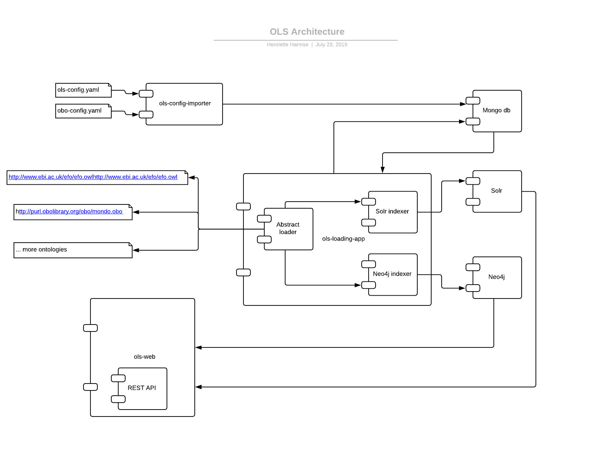

# OLS

Ontology Lookup Service from SPOT at EBI.

* OLS is currently live at the EBI here http://www.ebi.ac.uk/ols
* A REST API for OLS is described here http://www.ebi.ac.uk/ols/docs/api
* Instructions on how to build a local OLS installation are here
  http://www.ebi.ac.uk/ols/docs/installation-guide
* Run OLS with docker here
  https://github.com/MaastrichtUniversity/ols-docker
* Further OLS documentation can be found here
  http://www.ebi.ac.uk/ols/docs

## Overview



This is the entire codebase for the EBI OLS. OLS has been developed
around two key ontology indexes that can be built and used independently
from the core website. We provide services to build a Solr index and a
Neo4j index. The Solr index is used to provide text-based queries over
the ontologies while the Neo4j index is used to query the ontology
structure and is the primary driver of the OLS REST API.
 
OLS has been developed with the Spring Data and Spring Boot framework.
You can build this project with Maven and the following Spring Boot
applications will be available to run.
 
All of the apps are available under the ols-apps module.

* [ols-apps/ols-solr-app](ols-apps/ols-solr-app) - Spring Boot
  application for building a Solr index for one or more ontologies.
  Requires access to a Solr server.
* [ols-apps/ols-neo4j-app](ols-apps/ols-neo4j-app) - Spring Boot
  application for building a Neo4j index for one or more ontologies.
  Builds an embedded Neo4j database. You can run a Neo4j server that
  uses the generated Neo4j database.

To run a complete local OLS installation you will need a MongoDB
database. This is a lightweight database that is used to store all the
ontology configuration and application state information. See here for
more information http://www.ebi.ac.uk/ols/docs/installation-guide

* [ols-apps/ols-config-importer](ols-apps/ols-config-importer) - Spring
  Boot application for loading config files into the MongoDB database.
  This includes support for reading config files specified using the OBO
  Foundry YAML format.
* [ols-apps/ols-loading-app](ols-apps/ols-loading-app) - Spring Boot
  application for building the complete OLS indexes. This app fetches
  ontologies specified in the config files, checks whether they have
  changed from a previous download, and if they have changed, will
  create all the necessary Solr and Neo4j indexes.
* [ols-web](ols-web) - This contains the WAR file that can be deployed
  in Tomcat to launch the OLS website and REST API. It depends on
  [ols-term-type-treeview]
  (https://github.com/EBISPOT/ols-term-type-treeview) and
  [ols-tabbed-term-treeview]
  (https://github.com/EBISPOT/ols-tabbed-term-treeview).

## Run Solr and MongoDB services out of separate Docker containers

If you have Docker installed on your desktop or laptop, you now have the
option to run either or both of OLS's prequisite background services out
of their own containers. This saves you having to install and configure
historical versions of both these servers locally. The MongoDB server
image can be downloaded directly from DockerHub, while OLS's Solr server
requires a prior build process to recognise both of its cores. To build
the ols-solr image from the command line, enter:

**```bash#```**```./build_ols_solr_image.sh```

To run an instance (i.e. a container) of your freshly-minted ols-solr
image, alongside a separate mongo container, from the command line,
enter:

**```bash#```**```./run_ols_background_services.sh```

Any data you load into MongoDB and Solr are persistent, and will be
saved inside named Docker volumes, stored on your local machine, managed
and mounted by Docker itself.

## Run OLS dockerised (monolithic), specifying branch and commit hash / HEAD

If you have Docker installed on your desktop or laptop, you can build a
docker image by running the shell script `./build_ols_branch_image.sh`
with two parameters, the first being the branch you wish to check out
(often, if not typically, "master"), the second being the commit
(usually "HEAD", but you can also enter the start of the commit hash).
The image will take several minutes to build; an example invocation,
which creates a docker image from the latest commit to OLS's main
development branch, is shown below:

**```bash#```**```./build_ols_branch_image.sh 3.x-dev HEAD```

Once built, run the image by invoking the shell script
`./run_ols_branch_image.sh`. This requires not just two but an obligate
third and an optional fourth parameter:

1. the branch relating to the required pre-built image;
2. the commit relating to the required pre-built image;
3. a numeric (integer) increment to the default port numbers on which
   the various contained services will be exposed to the host;
4. "tomcat" as a literal string, if you simply want to run OLS with your
   own previously loaded data.
   
Parameter 3. above enables you to avoid clashes between port assignments
when running multiple contained instances of OLS. These port assignments
relate specifically to Tomcat (default port 8080), Solr (8983) and
MongoDB (27017). Parameter 4 should be added if you don't want to load
any new ontologies; Tomcat should be run only when all required data are
loaded. So, for example, to run a container for the first time, based on
the prebuilt image which you created above:

**```bash#```**```./run_ols_branch_image.sh 3.x-dev HEAD 1```

Or, if all required ontologies are loaded and up-to-date, and Tomcat is
ready to run:

**```bash#```**```./run_ols_branch_image.sh 3.x-dev HEAD 1 tomcat```

Whether you are running Tomcat or not, you will drop into a
non-interactive terminal inside your newly-created guest container; log
output from the various services will appear here. If you need to do
more than simply run Tomcat with existing data (i.e. data pre-loaded
from a previous session), you will need interactive access to the
running container, in a separate terminal. First you need the id of your
running container; from a separate terminal, enter:

**```bash#```**```docker ps```

To initiate an interactive termninal session on your already-running
container, enter:

**```bash#```**```docker exec -it -u ols```*```container_id```*```bash```

Your username will be set to "ols", which is privileged both to load
data into OLS, and to run Tomcat. Commands to load or refresh ontology
data in OLS are documented elsewhere. If you wish to invoke Tomcat and
start OLS interactively (once your ontology load is complete), enter:

**```bash#```**```catalina.sh run```

This runs Tomcat in the foreground. The catalina directory should
already be in your PATH variable, so there is no need for further
configuration.

Tomcat (if running) will be exposed on port 8081 on the host, Solr on
port 8984 and MongoDB on port 27018. Inside the container itself, the
default (original) port assignments are retained; they are simply mapped
to their respective incremented ports on the host (your desktop). To run
more containers (based on other git commits) simultaneously, ensure that
the third parameter is given a higher increment (2, 3, 4, ...). If you
have previously loaded data in a past container using the same base
image, this will have been stored in a managed docker volume and will be
reloaded by your new container. Otherwise, or possibly in addition, you
may want to load data for one or more ontologies using the ols-indexer
under the directory `ols-loading-app`. Loading can take several minutes.
Do not run Tomcat at the same time as loading data.

Multiple containers can be run simultaneously on the same host machine,
as long as each represents a unique git commit of OLS. Each container
runs Solr, MongoDB, Tomcat and embedded Neo4J servers simultaneously in
the same isolated namespace: there is no separation of services into
different containers, or any explicit orchestration.

## Customisation

It is possible to customise several branding options in `ols-web/src/main/resources/application.properties`:

* `ols.customisation.debrand` — If set to true, removes the EBI header and footer, documentation, and about page
* `ols.customisation.title` — A custom title for your instance, e.g. "My OLS Instance"
* `ols.customisation.short-title` — A shorter version of the custom title, e.g. "MYOLS"
* `ols.customisation.org` — The organisation hosting your instance
